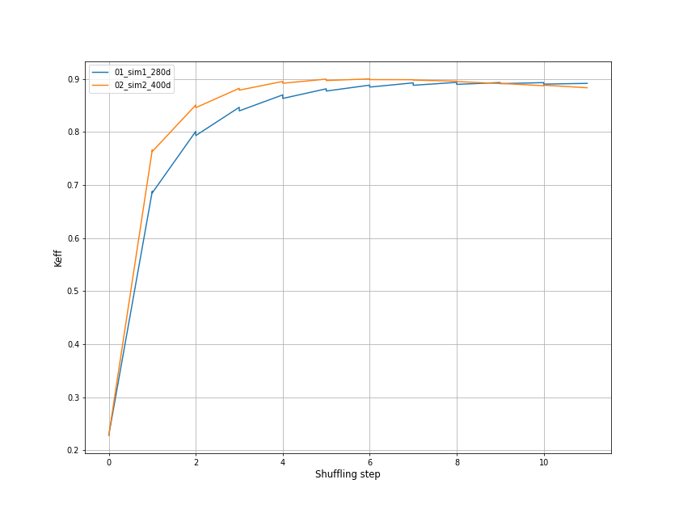
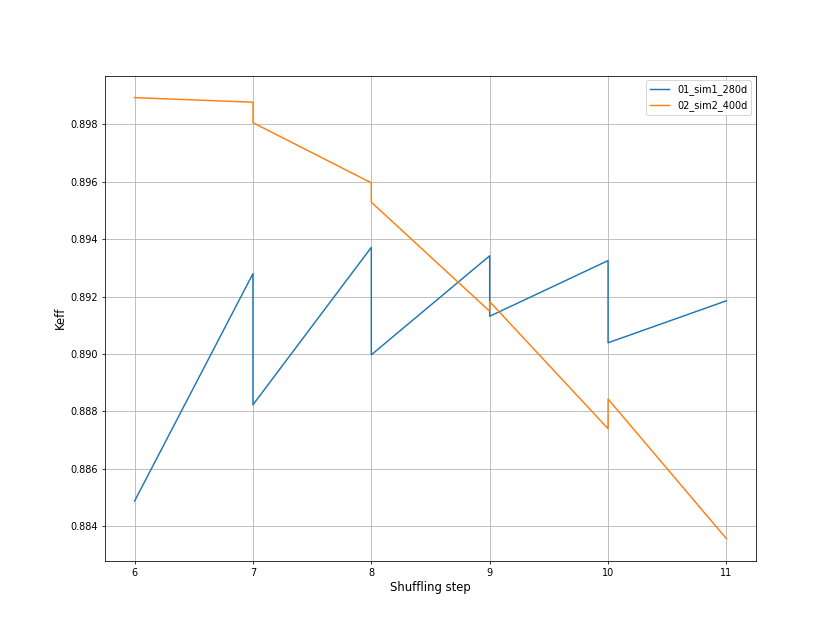

## Running the script

This one needs to be put inside here to get multiple results or just one if you have a single simulation folder

```
📂serpent_analysis
┣ 📂simulations
┃ ┣ 📂set_01
┃ ┃ ┣ 📜get_keff_vs_step_all_sim.py  (here)
┃ ┃ ┣ 📜get_keff_vs_days_all_sim.py  (here)
┃ ┃ ┣ 📂01_sim1_280d
┃ ┃ ┃ ┣ 📂input
┃ ┃ ┃ ┣ 📂wh_lfrsuffleNo0
┃ ┃ ┃ ┃  ┗ 📜wh_lfr_res.m
┃ ┃ ┃ ┣         ... 
┃ ┃ ┃ ┣ 📂wh_lfrsuffleNo10
┃ ┃ ┃ ┃  ┗ 📜wh_lfr_res.m
┃ ┃ ┣ 📂02_sim2_400d
┃ ┃ ┃ ┣ 📂input
┃ ┃ ┃ ┣ 📂wh_lfrsuffleNo0
┃ ┃ ┃ ┃  ┗ 📜wh_lfr_res.m
┃ ┃ ┃ ┣         ... 
┃ ┃ ┃ ┣ 📂wh_lfrsuffleNo10
┃ ┃ ┃ ┃  ┗ 📜wh_lfr_res.m
```

Variables :

```python
# This is the main sss2 file name, for the code to pick up the _res.m files
FILE_NAME = "wh_lfr"
```

Functions inside the scrips :
```python
# Function takes one optional argument, it plots an extra plot of the last 2 shuffling steps
plot_keff(5)
```


```
Result :
📂serpent_analysis
┣ 📂simulations
┃ ┣ 📂set_01
┃ ┃ ┣ 📈 Keff_vs_EFPD_from_step_0
┃ ┃ ┣ 📈 Keff_vs_EFPD_from_step_0
┃ ┃ ┣ 📈 Keff_vs_STEPS_from_step_5
┃ ┃ ┗ 📈 Keff_vs_STEPS_from_step_5
```

Example output:
- Entire shuffling steps

- Last five steps 
